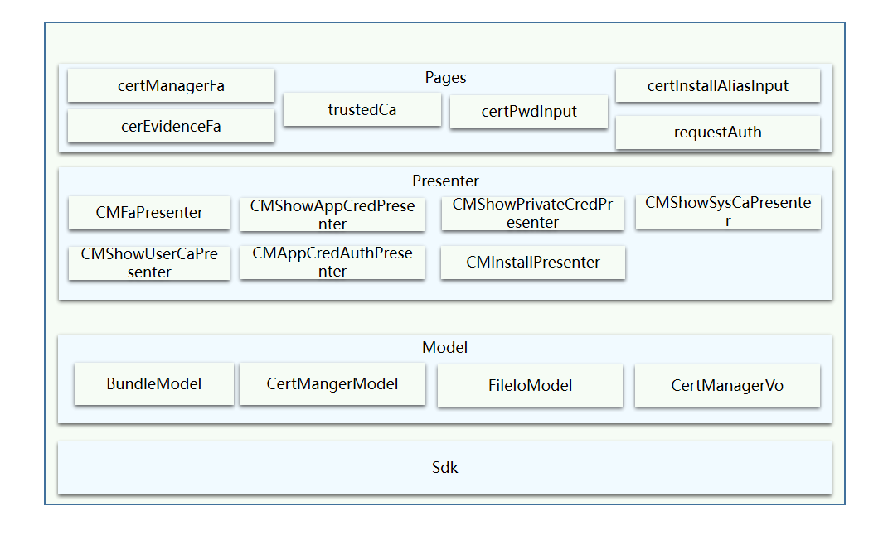

# 证书管理应用

## 简介

### 内容介绍

证书管理应用是OpenHarmony中预置的系统应用，主要的功能包含系统根证书查看与启用禁用，用户根证书的安装、查看、启用禁用与卸载，公共业务证书的安装、查看、授权管理与卸载，私有业务证书的查看等功能。

### 架构图



该应用架构主要结合MVP和领域驱动设计思路。

### 目录

```
/CertManagerFa/
├── AppScope									# 应用配置
├── common										# 公共工具类
└── product
    └── phone
        └── src
            └── main
                ├── ets							# 代码目录
                │   ├── Application				# AbilityStage类实现
                │   ├── MainAbility				# Ability类实现
                │   ├── model					# model层功能类实现
                │   ├── pages					# 页面展示实现
                │   ├── presenter				# 页面presenter层功能类实现
                │   └── stub					# certManager打桩代码
                └── resources					# 资源文件目录
```

### 使用方法

其他应用拉起证书管理FA并执行证书安装，使用方法如下：

```
globalThis.context.startAbility(
{
    bundleName: "com.example.applications_certmanager",
    abilityName: "MainAbility",
    uri: "certInstall",
})
```

其他应用拉起证书管理FA并执行申请应用授权，使用方法如下：

```
//拉起应用申请应用授权
globalThis.context.startAbilityForResult(
{
    bundleName: "com.example.applications_certmanager",
    abilityName: "MainAbility",
    uri: "requestAuthorize",
    parameters: {
    	appUid: appUid,		//传入申请应用的appUid
    }
})
.then((data) => {
	if (!data.resultCode) {
    	this.authUri = data.want.parameters.authUri;	//授权成功后获取返回的authUri
    }
})
```

