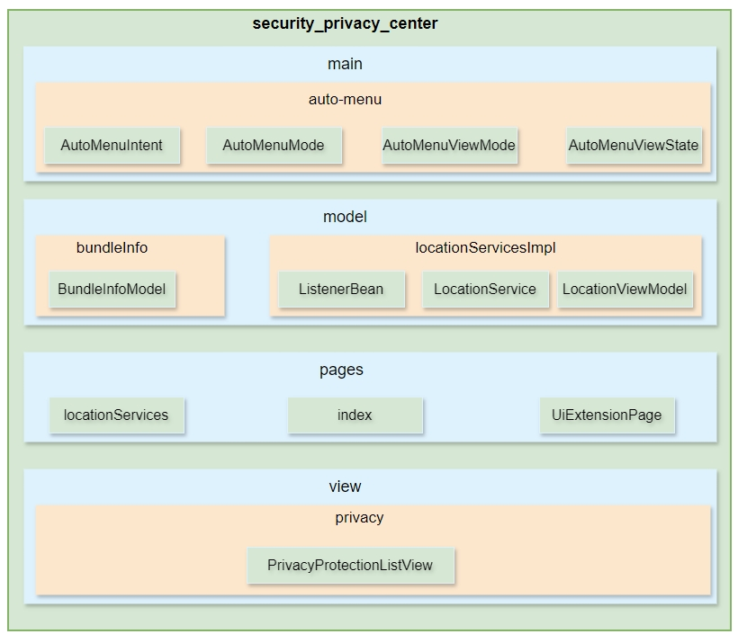

## 简介

OpenHarmony上“设置”应用中的“隐私安全”菜单中，需要按需展示其它领域的相关菜单入口，并且用户点击之后需提供跳转拉起对应的业务功能处理页面的能力，因此需提供接入机制，其它领域适配之后，可以实现正常的菜单展示功能。

​	安全隐私接入框架架构图如下所示：



## 目录

```
/security_privacy_center/
├── AppScope									# 应用配置
├── CertManager							        # 证书管理应用
└── entry
        └── src
            └── main
                ├── ets							# 代码目录
                │   ├── common					# 子组件及工具类实现
                │   ├── entryability			# Ability类实现
                │   ├── main					# 功能类实现
                │   ├── model					# model类及位置信息类功能实现 
                │   ├── pages				    # 接入菜单页面及位置信息页面展示实现
                │   └── view					# 具体应用接入页面展示实现
                └── resources					# 资源文件目录
```

## 使用说明  

如果需要编译安全隐私接入框架的代码，需要使用新版本的[full SDK](https://gitee.com/openharmony/docs/blob/master/zh-cn/application-dev/faqs/full-sdk-compile-guide.md)。

如果仅需接入安全隐私中心，则使用发布版本的public SDK即可。应用接入指导参考：[应用接入指导说明](https://gitee.com/openharmony/docs/blob/master/zh-cn/application-dev/security/SecurityPrivacyCenter/auto-menu-guidelines.md)。

## 相关仓

**security_privacy_center**
