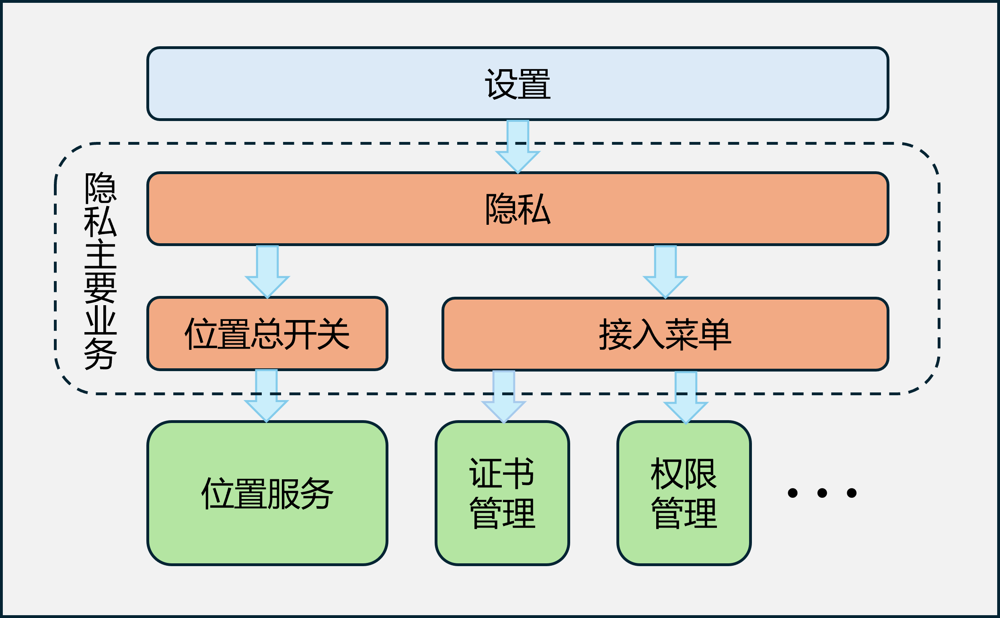

# 隐私部件

- [简介](#简介)
- [目录](#目录)
- [编译构建](#编译构建)
- [说明](#说明)
- [相关仓](#相关仓)

## 简介

隐私是OpenHarmony上向用户提供位置总开关管理功能以及给一些隐私权限相关的应用提供入口的一个部件。

隐私页面位于“设置”应用中的“隐私”菜单中，主要包含如下两个部分：

- 位置总开关管理页面：用户可以在这里管理设备的位置服务总开关。
- 隐私权限相关接入应用入口列表：展示一个菜单列表，用于给一些应用提供入口。应用按照使用说明中的指导进行配置，隐私就会在页面上展示出一个入口，用户可以从这里点击进入。

隐私架构图如下所示：



## 目录

```
/security_privacy_center/
├── AppScope									# 应用配置
└── entry
        └── src
            └── main
                ├── ets							# 代码目录
                │   ├── common					# 子组件及工具类实现
                │   ├── entryability			# Ability类实现
                │   ├── main					# 功能类实现
                │   ├── model					# model类及位置信息类功能实现 
                │   ├── pages				    # 接入菜单页面及位置信息页面展示实现
                │   └── view					# 具体应用接入页面展示实现
                └── resources					# 资源文件目录
```

## 编译构建

1. 搭建鸿蒙开发环境
   - [DevEco Studio官网](https://developer.huawei.com/consumer/cn/deveco-studio/)下载新版IDE，并按照IDE指引完成`File-->Settings-->OpenHarmony SDK`的配置。
   - 按照[ 如何替换full-SDK](https://gitee.com/openharmony/docs/blob/master/zh-cn/application-dev/faqs/full-sdk-switch-guide.md)文档完成full-SDK的替换，请使用新版本的[full SDK](https://gitee.com/openharmony/docs/blob/master/zh-cn/application-dev/faqs/full-sdk-compile-guide.md)。
2. 拉取代码并编译
   - 使用`git clone https://gitee.com/openharmony/security_privacy_center.git`命令拉取代码。
   - 使用DevEco Studio打开项目，按照提示Sync项目，之后在`Build-->Build Haps/App(s)-->Build Hap(s)`开启项目编译。

## 说明  

### 接口说明

不涉及

### 使用说明

如果应用仅需接入安全隐私中心，则使用发布版本的public SDK即可；应用接入方法可以参考：[应用接入指导说明](https://gitee.com/openharmony/docs/blob/master/zh-cn/application-dev/security/SecurityPrivacyCenter/auto-menu-guidelines.md)。

## 相关仓

**[security_privacy_center](https://gitee.com/openharmony/security_privacy_center)**

**[security_certificate_manager](https://gitee.com/openharmony/security_certificate_manager)**

