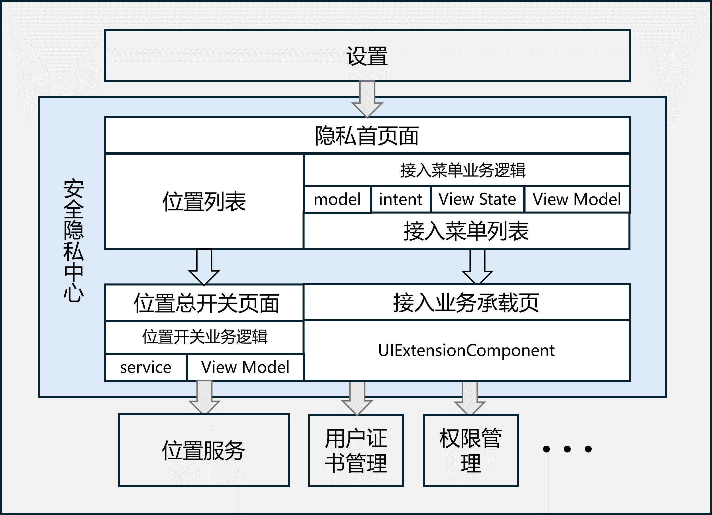

# 安全隐私中心

- [简介](#简介)
- [目录](#目录)
- [编译构建](#编译构建)
- [说明](#说明)
- [相关仓](#相关仓)

## 简介

安全隐私中心是OpenHarmony上向用户提供位置总开关管理功能以及给一些隐私权限相关的应用提供入口的一个部件。

安全隐私中心页面位于“设置”应用中的“隐私”菜单中，主要包含如下两个部分：

- 位置总开关管理页面：用户可以在这里管理设备的位置服务总开关。
- 隐私权限相关接入应用入口列表：展示一个菜单列表，用于给一些应用提供入口。应用按照使用说明中的指导进行配置，隐私就会在页面上展示出一个入口，用户可以从这里点击进入。

隐私架构图如下所示：



## 目录

```
/security_privacy_center/
├─AppScope                                              # 应用级配置信息   
├─entry 
│  ├─build-profile.json5                                # 模块级构建配置文件
│  ├─hvigorfile.ts                                      # 编译构建任务脚本
│  ├─oh-package.json5                                   # 依赖库配置文件
│  └─src
│      ├─main
│      │  ├─module.json5                                # 模块级配置文件
│      │  ├─ets                                         # 源码目录
│      │  │  ├─common
│      │  │  │  ├─base                                  # MVI架构基类 
│      │  │  │  ├─bean                                  # 实例对象目录
│      │  │  │  ├─components                            # 公共组件目录
│      │  │  │  ├─constants                             # 常量类目录      
│      │  │  │  └─utils                                 # 工具类目录       
│      │  │  ├─entryability
│      │  │  │      EntryAbility.ets                    # 应用入口ability文件 
│      │  │  ├─main
│      │  │  │  └─auto_menu                             # 接入菜单相关业务逻辑目录      
│      │  │  ├─model
│      │  │  │  ├─bundleInfo                            # 应用包信息业务处理目录  
│      │  │  │  └─locationServicesImpl                  # 位置总开关相关业务逻辑目录  
│      │  │  ├─pages
│      │  │  │   ├─Index.ets                            # 隐私中心首页面布局
│      │  │  │   ├─locationServices.ets                 # 位置总开关页面
│      │  │  │   └─UiExtensionPage.ets                  # 接入菜单接入方承载页面
│      │  │  └─view
│      │  │      └─privacy
│      │  │              PrivacyProtectionListView.ets  # 首页接入菜单列表组件       
│      │  └─resources                                   # 应用字串、图标资源目录     
│      └─ohosTest                                       # 测试用例代码目录           
├─hvigor                                                # 编译构建文件  
├─build-profile.json5                                   # 工程级构建配置文件
├─hvigorfile.ts                                         # 编译构建任务脚本
├─LICENSE                                               # 许可文件
├─oh-package.json5                                      # 依赖库配置文件
├─signature                                             # 应用签名相关文件
└─README.md
```

## 编译构建

1. 搭建开发环境
   - [DevEco Studio官网](https://developer.huawei.com/consumer/cn/deveco-studio/)下载新版IDE，并按照IDE指引完成`File-->Settings-->OpenHarmony SDK`的配置。
   - 按照[ 如何替换full-SDK](https://gitee.com/openharmony/docs/blob/master/zh-cn/application-dev/faqs/full-sdk-switch-guide.md)文档完成full-SDK的替换，请使用新版本的[full SDK](https://gitee.com/openharmony/docs/blob/master/zh-cn/application-dev/faqs/full-sdk-compile-guide.md)。
2. 拉取代码并编译
   - 使用`git clone https://gitee.com/openharmony/security_privacy_center.git`命令拉取代码。
   - 使用DevEco Studio打开项目，按照提示Sync项目，之后在`Build-->Build Haps/App(s)-->Build Hap(s)`开启项目编译。

## 说明  

### 接口说明

不涉及

### 使用说明

如果应用仅需接入安全隐私中心，则使用发布版本的public SDK即可；应用接入方法可以参考：[应用接入指导说明](https://gitee.com/openharmony/docs/blob/master/zh-cn/application-dev/security/SecurityPrivacyCenter/auto-menu-guidelines.md)。

## 相关仓

**[security_privacy_center](https://gitee.com/openharmony/security_privacy_center)**

**[security_certificate_manager](https://gitee.com/openharmony/security_certificate_manager)**

